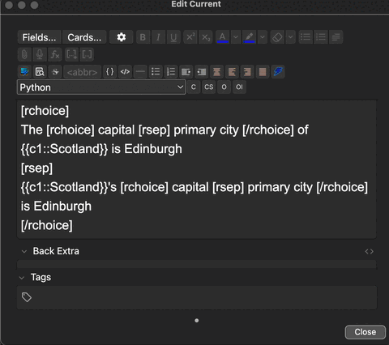
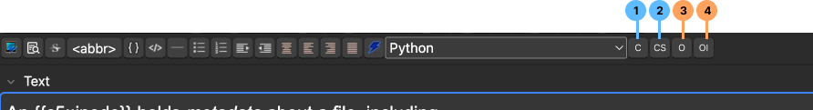
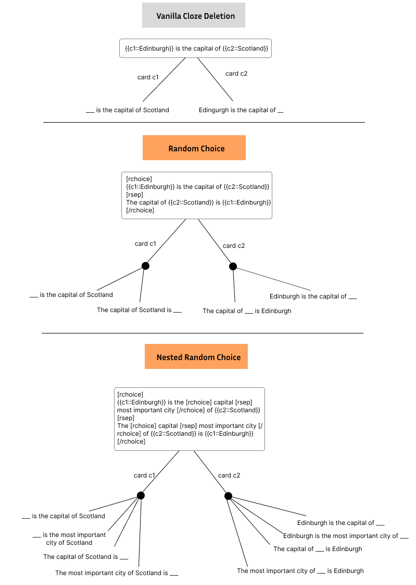
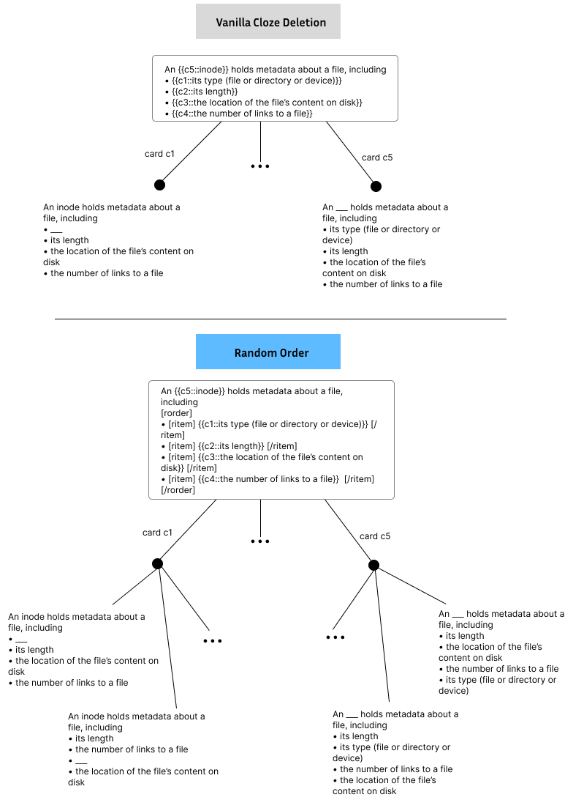

# Anki Card Text Randomizer: Memorize the *Concept*, not the Card
**Purpose**: I found myself often knowing the answer because I recognize the card, not because I understood the question it asked. By randomizing order and phrasing, this forces me to evaluate the card's question.

This addon is a minimal toolkit for you to design randomized cards.
- Randomize order (e.g. of lists)
- Choose only 1 thing to appear from a set of things

Works with cloze deletion.



# How to Use
Wrap your text in the appropriate context (either *Random Choice* `[rchoice]Content[/rchoice]` or *Random Order*), then use the appropriate markup (see below).

- Tip: Nesting is fine for both *Random Choice* and *Random Order* (also, feel free to mix them!)
- Tip: Buttons and shortcuts help a lot.

## Random Choice
Add the context, and separate each candidate choice with `[rsep]`.

**Example:**
1. Determine the text you want to randomize the choice of: E.g. `My Choice 1 My Choice 2 My Choice 3`
1. Add *Random Choice* context (*Alt+Shift+c*): `[rchoice]My Choice 1 [rsep] My Choice 2 [rsep] My Choice 3[/rchoice]
1. Add the separators (*Alt+Shift+s*): `[rchoice]My Choice 1 [rsep] My Choice 2 [rsep] My Choice 3[/rchoice]

The choice is random. Thus, if you were to see this card 5 times, it might appear each time as follows:
1. 1st appearance: `My Choice 2`
2. 2nd appearance: `My Choice 1`
3. 3nd appearance: `My Choice 1`
4. 4nd appearance: `My Choice 3`
5. 5nd appearance: `My Choice 1`

## Random Order
Wrap each reorder chunk of text in `[ritem]My chunk[/ritem]`

**Example**
1. Determine the text you want to randomize the choice of: E.g. `• My Item 1 • My Item 2 • My Item 3`
2. Add the *Random Order* context (*Alt+Shift+o*): E.g. `[rorder]• My Item 1 • My Item 2 • My Item 3[/rorder]`
2. Add the *Random Order Item* context (*Alt+Shift+i*): E.g. `[rorder]• [ritem] My Item 1 [/ritem] • [ritem] My Item 2 [/ritem] • [ritem] My Item 3 [/ritem][/rorder]`

**Example:**
1. Determine the text you want to randomize the choice of: E.g. `My Choice 1 My Choice 2 My Choice 3`
1. Add Random Choice context: `[rchoice]My Choice 1 [rsep] My Choice 2 [rsep] My Choice 3[/rchoice]
1. Add the separators: `[rchoice]My Choice 1 [rsep] My Choice 2 [rsep] My Choice 3[/rchoice]

The order is random. Thus, if you were to see this card 5 times, it might appear each time as follows:
1. 1st appearance: `• My Item 2 • My Item 3 • My Item 1`
1. 2nd appearance: `• My Item 3 • My Item 2 • My Item 1`
1. 3nd appearance: `• My Item 3 • My Item 1 • My Item 2`
1. 4nd appearance: `• My Item 1 • My Item 2 • My Item 3`
1. 5nd appearance: `• My Item 1 • My Item 3 • My Item 2`


## Buttons and Shortcuts


**Button 1 (*Alt+Shift+c*):** Wrap text selection in a *Random Choice* context (e.g. `My Text` becomes `[rchoice] My Text [\rchoice]`)

**Button 2 (*Alt+Shift+s*):** Add a *Random Choice* seperator (`[rsep]`)

**Button 3 (*Alt+Shift+o*):** Wrap selection in a *Random Order* context (e.g. `My Text` becomes `[rorder] My Text [\rorder]`)

**Button 4 (*Alt+Shift+i*):** Mark selection as a *Random Order Item* (e.g. `My Item` becomes `[ritem] My Text [\ritem]`)

## Example Cards

```
An {{c5::inode}} holds metadata about a file, including
[rorder]
• [ritem] {{c1::its type (file or directory or device)}} [/ritem]
• [ritem] {{c2::its length}} [/ritem]
• [ritem] {{c3::the location of the file’s content on disk}} [/ritem]
• [ritem] {{c4::the number of links to a file}}  [/ritem]
[/rorder]
```

```
[rchoice]
{{c1::observational}} slicing does ({{c2::delete}} → {{c2::execute}} → {{c2::observe}})
[rsep] 
({{c2::delete}} → {{c2::execute}} → {{c2::observe}}) is done by {{c1::observational}} slicing
[/rchoice]
```

# Random Choice


# Random Order


# Known Issues
- Getting rid of whitespace before and after the [identifiers] does not always work optimally (some newlines might be preserved)
    - I'm unclear on why this is the case. It works fine in vanilla python. I suspect anki is sneakily wrapping things in paragraph tags, or something